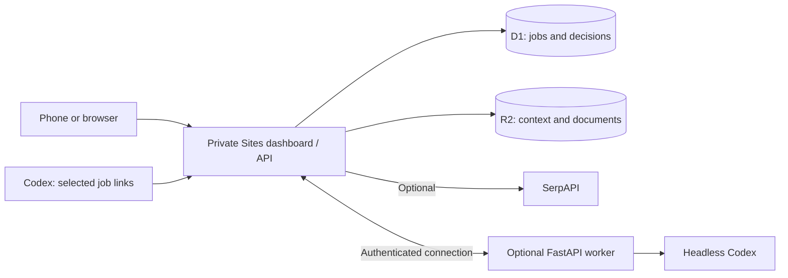

# CareerAutomation

[**Try the interactive demo**](https://career-automation-demo.punnkrit.chatgpt.site) · [Setup guide](docs/SETUP.md) · [Screenshots and demo tour](docs/DEMO.md)

I use ChatGPT to help with my job search almost every day. What got tedious was moving everything between chats, job boards, resume files, and Google Sheets. I built CareerAutomation to keep that work in one place and make better use of the ChatGPT subscription I already had.

For each interesting role, I used to paste my resume and the job description into a chat, discuss whether to apply, work through resume changes, and then update a spreadsheet. Company research and networking added even more places to keep track of things.

The first version ran on my computer. I later made it accessible through Cloudflare Tunnel, but keeping a workstation on just to check a job from my phone got old quickly. The current architecture puts the dashboard and saved information in the cloud. A computer connects when I want it to run AI tasks.

This repository is the reusable edition of that application. It is currently **private and being prepared for friends to install**. You can explore the separate demo without installing anything. It uses fictional data, prepared analyses, and browser-local edits.

## How I actually use it

1. A scheduled ChatGPT task finds possible jobs for me.
2. I choose the ones that look interesting.
3. I send those links to Codex and ask it to ingest the listings into the dashboard.
4. I review the analysis, make my own decision, and track the application in one place.

I deliberately choose what goes into the dashboard. Importing every search result would make the tracker less useful. SerpAPI search is available as an optional integration, but selected-link ingestion is my usual workflow.

The company and role research features are implemented too. They have had less use in my own routine than job evaluation and tracking.

## Your tracker comes first

The first milestone is your own private **Sites-hosted dashboard**, available from a computer or phone. Adding jobs, tracking decisions, and managing networking work independently of an AI worker or search API key. The hosted Setup page keeps those optional connections separate.

| Capability | Needs a local worker? | Needs SerpAPI? |
| --- | --- | --- |
| Add, view, and edit jobs | No | No |
| Track decisions and networking | No | No |
| Ask Codex to ingest selected jobs through the Site API | No persistent worker; requires an authenticated Codex session and Site API access | No |
| View saved analyses and documents | No | No |
| Run new AI analysis, research, packets, or reports | Yes | No |
| Search inside the dashboard | No; search runs in the cloud | Yes |

AI execution uses your own ChatGPT-authenticated Codex access. It does not require an OpenAI API key for those workflows. Account eligibility, usage limits, Sites access, and any separate infrastructure/search costs still apply; a subscription alone is not a completed installation.

## Setup with Codex

Start with the [setup guide](docs/SETUP.md). Provisioning uses Codex and the Sites plugin; the dashboard then handles your profile and explains the optional connections. A complete fresh-user Windows/Mac trial is still a release gate, so this is not yet a one-click installer.

Open this repository in Codex and say:

> Help me set up my own private CareerAutomation dashboard. Read AGENTS.md and docs/SETUP.md, use my own accounts, get the browser tracker working first, and skip SerpAPI. Explain which sign-in steps I need to complete myself.

Codex helps create your private Site and configure its storage. In **Setup**, you can paste your resume, add verified background, and describe your preferences. They are saved in cloud storage and sent with each analysis. Connecting a worker is a later, optional step.

You don't need to maintain personal Markdown or YAML files in the repository. Put supporting stories, accomplishments, and any approved application answers in Setup's background field. Leave unknown details blank; the app should ask for review rather than invent them.

## Bring in selected jobs

Once your Site API connection is configured, tell Codex:

> Read docs/PROGRAMMATIC_JOB_INGESTION.md and add these jobs to my dashboard: [paste links].

Codex retrieves each listing and sends its title, company, location, link, and complete description through the supported API. If a listing cannot be read, paste the description instead. Saving a job does not depend on an online AI worker. The ingestion result reports whether analysis was accepted; it does not promise deferred execution.

See [the everyday workflow](docs/DAILY_WORKFLOW.md) and [the exact ingestion contract](docs/PROGRAMMATIC_JOB_INGESTION.md).

## How it fits together

The worker can go offline without taking your saved work with it. New AI controls become unavailable while it is offline; work is not silently queued. See the [architecture and ingestion sequence](docs/ARCHITECTURE.md) for more detail.

## Development status

- Available: shared-component interactive demo, hosted Setup page, cloud candidate profiles, capability-aware optional search, API ingestion, and a portable foreground worker command.
- Each installation needs its own private Site, storage, account sign-ins, and optional tunnel. The repository includes no live installation identity or personal records.
- Windows/macOS: the foreground command avoids Bash/systemd; real native authentication and end-to-end friend trials remain unverified. WSL is optional for users, and remains the development environment used here.
- Research is implemented but has had less personal use than tracking and evaluation. The demo makes that experience easy to inspect.
- Validation and remaining dependency findings are recorded in [VALIDATION.md](docs/VALIDATION.md).

For engineering scope, tests, and release gates, see [RELEASE_PLAN.md](docs/RELEASE_PLAN.md). This project does not automatically submit job applications.
