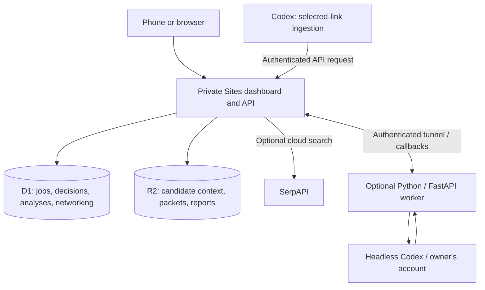

# Why the tracker and worker are separate

The dashboard is useful even when no AI is running. Keeping it on a workstation meant that closing the laptop also closed access to the job search. The cloud now owns persistent information; the workstation provides optional compute.



## What persists

| Information | Authority |
| --- | --- |
| Jobs, decisions, analyses, research, networking, operation metadata | D1 |
| Resume and background context, packets, reports, run artifacts | R2 |
| Worker SQLite, temporary files, recovery records | Machine-local scratch or diagnostics |
| Demo edits | Browser-local storage only; intentionally separate from the application |

## A selected job's path

```mermaid
sequenceDiagram
  actor Owner
  participant Agent as Codex session
  participant Site as Private Site
  participant Worker as Optional worker
  Owner->>Agent: Add these selected links
  Agent->>Site: Full JD and structured fields through ingestion API
  Site->>Site: Save job in D1
  alt Analysis requested and worker reachable
    Site->>Worker: Job + active R2 candidate context
    Worker->>Worker: Run headless Codex
    Worker->>Site: Authenticated result callback
    Site->>Site: Save result and artifacts
  else Worker unavailable or tracking only
    Site-->>Agent: Job saved; analysis not accepted
  end
  Site-->>Owner: Saved job and available results
```

There is no durable offline AI queue. An unavailable worker does not prevent tracking. A user retries AI after reconnecting. Operation leases prevent a late worker result from overwriting a newer attempt; callbacks are validated and duplicate completion delivery is idempotent.

## Candidate context

The hosted Setup page accepts resume text, verified background, and preferences. It writes content-addressed profile versions to R2 and atomically selects the active version in D1. Each analysis receives that context. Python context variables isolate concurrent operations so one operation cannot borrow another's profile.

## Demo boundary

The public demo is a static build with fictional fixtures. The real application's Worker, secrets, D1, and R2 are not deployed with it. The same React components use a browser-only adapter for demo edits, while live installations use the authenticated private Site API.

## Deliberate limits

This is a personal workspace, with a separate private installation for each owner. It does not implement multi-tenant account provisioning, payment, or automatic application submission. Sites access and the owner's service configuration are prerequisites for a private installation. The native foreground worker avoids systemd, but real Windows/macOS authentication and tunnel acceptance tests remain release gates.
