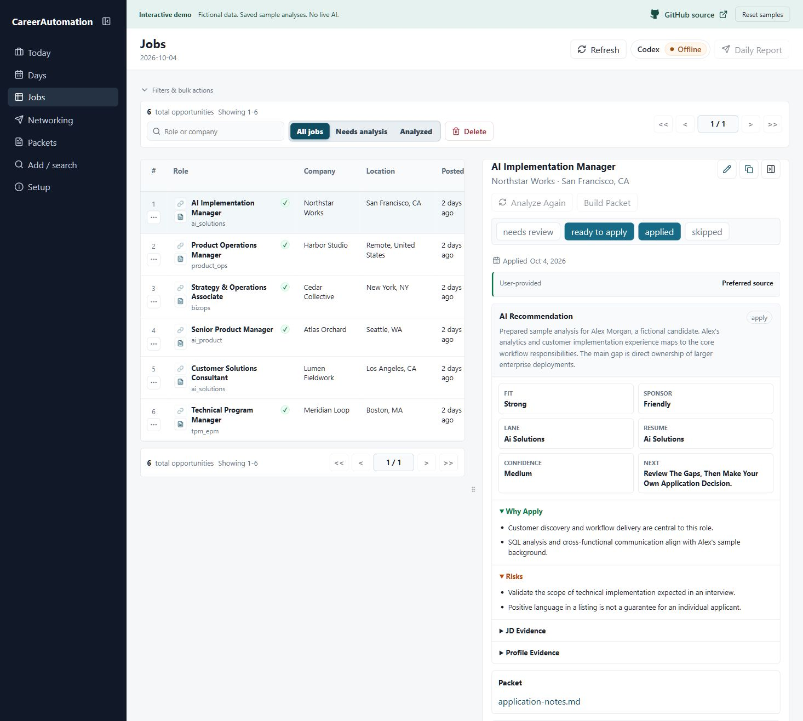
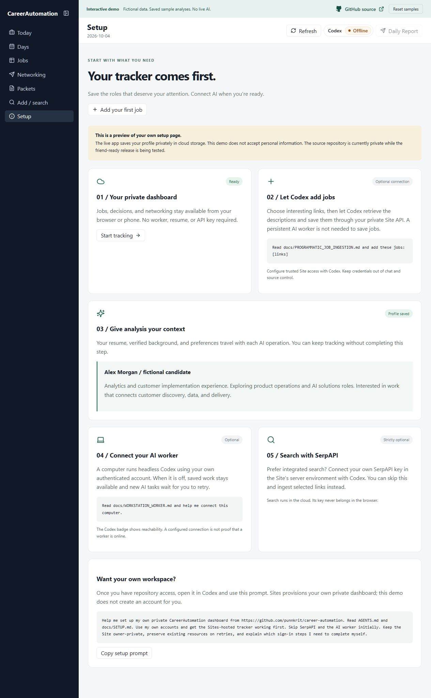
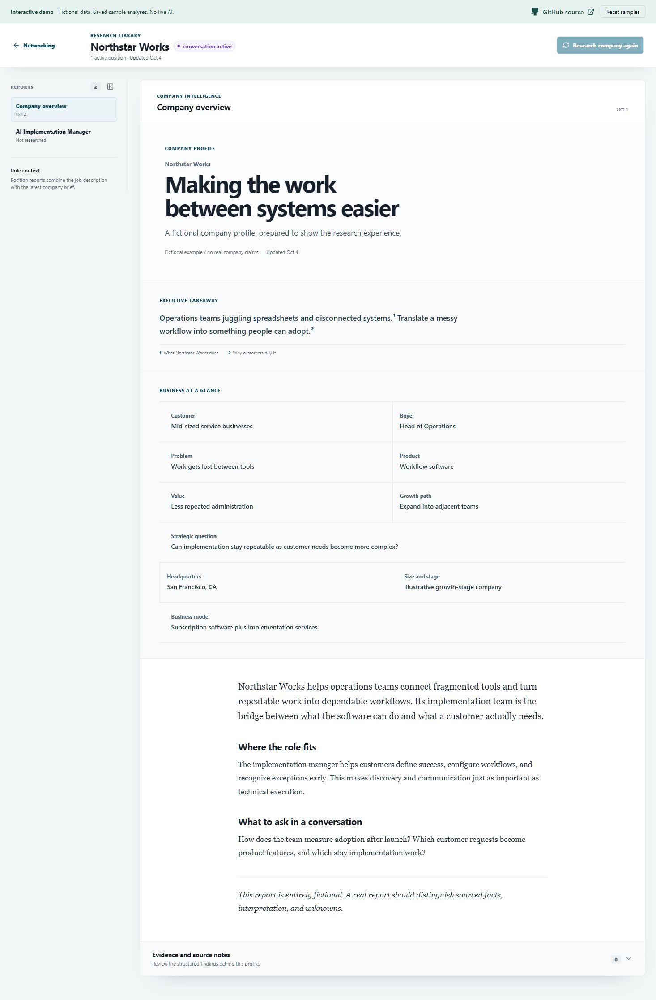
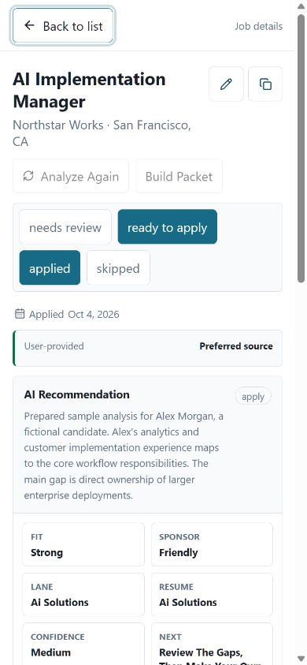

# Explore the demo

[Open CareerAutomation](https://career-automation-demo.punnkrit.chatgpt.site)

The demo opens directly to the Jobs dashboard. **GitHub source** opens the repository in a new tab; repository access remains restricted while it is private.

This is a separate static Site built from the same React dashboard as the private application. Every company, job, candidate, contact, analysis, and document in the demo is fictional. AI results are prepared examples, not live generations.

## A two-minute tour

1. Open the dashboard and select **AI Implementation Manager** at Northstar Works. Read the recommendation, evidence, risks, and sponsorship uncertainty.
2. Change the decision to **Applied**, then refresh. Changes stay in this browser's local storage.
3. Open **Networking**, select Northstar Works, and try a relationship milestone. Open the full research report.
4. Open **Add / search** and save a fictional job. Integrated search is optional and disabled here.
5. Open **Setup** to see the tracker-first onboarding experience.
6. Use **Reset samples** to restore the starting data.

The demo cannot run AI, search SerpAPI, connect a worker, accept a resume profile, or access the author's dashboard. It has no D1/R2 bindings or application API. Do not use it as your real tracker: browser storage can be cleared and does not sync across devices. Your own private installation stores records in D1 and documents in R2.

## Screenshots

These are actual screenshots of the fictional-data demo, captured October 4, 2026.

### Jobs and saved analysis



### Tracker-first setup



### Company research



### Mobile



## Run or update the demo

```sh
npm ci
npm run demo
npm run build:demo
```

The demo build uses `vite.demo.config.ts` and writes `dist-demo/`. Its API adapter never falls through to network requests. Unimplemented actions explain that a private installation is required.

To publish, follow the installed Sites skill. Keep a separate demo checkout and its own Site identity. Use the static hosting manifest (`static.directory: "dist"`, no D1/R2) and `scripts/build-demo-site.mjs` to build the demo into `dist/`. Do not deploy `worker/index.ts` as a public demo: the full application relies on the private Sites access boundary.

Keep the GitHub repository private until its owner explicitly approves public release.
